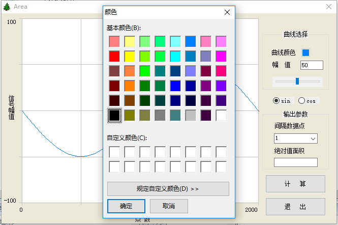
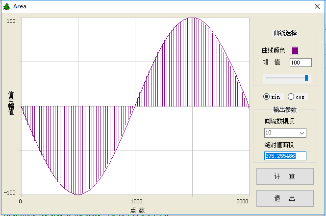

## Area ##
	 Area这是一个函数的面积计算的图形显示程序，将函数图形也坐标轴的面积划分成多个长方形和三角形，用所有的长方形和三角形的面积近似表示函数的面积。 

### 支持的函数 ###
* Sin 
* Cos

### 使用说明 ###
1. 软件中有曲线颜色、幅值、函数选择、间隔数据点、绝对值面积、计算和退出。

	**曲线颜色：**表示绘制图形的线条颜色，包括函数的线条颜色和绘制函数面积的线条颜色。

	**幅值：**表示函数的振幅，例如：y=A*sin(x),其中A表示的即振幅。

	**函数选择：**通过函数选择确定计算的函数类型，界面的表示范围在[0,2π].默认分隔为2000份，与间隔数据点对应。

	**间隔数据点：**表示计算函数面积时划分图形的粒度，粒度越小，计算的面积越趋于实际面积。

	**绝对值面积：**表示通过计算多个长方形和三角形的面积总和，面积的大小与间隔数据点和振幅的取值相关。

	**计算：** 点击计算按钮，计算当前参数下的绝对值面积，显示在文本框中。

	**退出：**点击退出按钮，退出程序。

2. 打开软件，如图1所示，可以点击图形框选择函数线条的颜色。
	

3. 通过拖动幅值下面的滑块或者手动输入幅值，改变图形的振幅，手动输入的幅值超过100时，图形会显示不完全，因为显示界面有限，但是计算的绝对值面积是正确的。
4. 选择计算的函数后，再通过选择间隔数据点确定计算图形面积的粒度，目前预设的数据点为从1到10。
5. 最后一步，计算当前参数下的函数绝对值面积，并将面积用阴影表示出来，如图2所示。
	

6. 结束